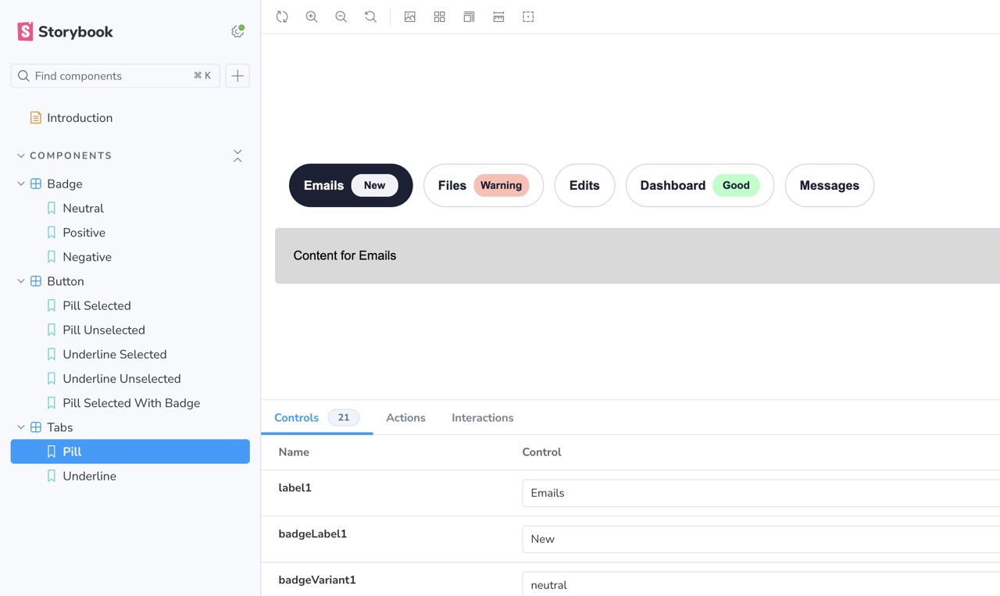
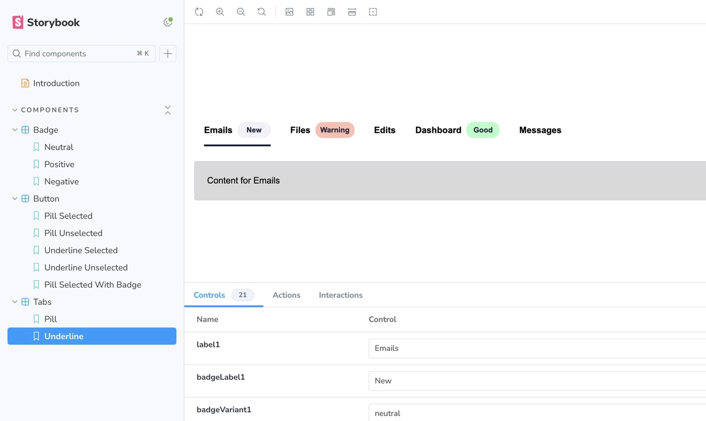

# Frontend Interview - Design System

## Live link

https://frontend-design-system-primait.netlify.app/

[](https://app.netlify.com/sites/frontend-design-system-primait/deploys)

## Figma file

The [Figma file of the home test is available](https://www.figma.com/design/OclakAGLSXDoMKLFvwLNMP/%F0%9F%92%BB-Design-System-Home-Test---Tabs-Component?node-id=0-1&t=4pG7NN6HKxgxroDz-1).

## Stack

- `react`
- `storybook`
- `vitest`

## Install and run

```bash
# Install dependencies
# This project use `pnpm` as package manager, but you can use also `npm` or `yarn`.
pnpm install

# And run the project
pnpm dev

# Optional: Run Storybook
pnpm storybook
```

## Acceptance Criteria

You need to develop the tab component following the acceptance criteria which we write in the form of a user story:

✅ As a developer, I want to be able to switch between different variants of the Tabs, according to the design.

- Variants of the tabs can be chosen within `Tabs.tsx`
- Variants can be viewed in within Storybook

✅ As a developer, I want to add a Badge to the Tab using the Tab's API, to display additional information.

- `Badges` are components themselves, these import into a `Button`. They can be added and removed with using`<Tabs>` as a component, this use can be seen within `index.tsx`

✅ As a developer, I want to choose between different Badge variants to add to the Tab using the Tab's API.

Similar to above, you can config `Tabs.tsx` accordingly. This component allows relevant config.

✅ As a mobile user, I want to be able to scroll through the Tab list if it’s wider than my screen, so I can access all Tabs.

This has been mimicked on desktop as well.

There isn’t a specific way you should present your project, so feel free to structure it however you prefer.

Design System Context: Build your component with reusability in mind, as it will be part of a larger Design System.
Accessibility: Ensure your component is accessible and follows best practices.
Restrictions:

✅ Please don't use Tailwind or other CSS frameworks.

✅ Use the CSS preprocessor you prefer. Alternatively, you can use CSS-in-JS or plain CSS, the important thing is writing CSS from scratch.

✅ React: The React part should be a raw implementation.

Not sure what “raw” implementation is, but it’s not using any 3rd parties or plugins. Using modules, hand-written `SCSS`.

✅  Storybook: If you're familiar with it, feel free to use Storybook to showcase your component.

Updated this to have basic views and options.  Did not include tests as out of scope.

## Accessibility

- An additional `heading` is hidden to give context that the user is about to interact with a "Menu". This could change depending on the Content or context use.

- Relative values are used, zooming working correctly.

- Keyboard `Tab` and `Arrow Keys` `Home`  work as expected, additional semantics are added for relevant elements, `tabpanel` roles are assigned inline with standards. Relevant `aria-controls `, applied and once active `aria-selected` is active.

- To make it easy for screen reader users to navigate from a tab to the beginning of content in the active tabpanel, the tabpanel element has `tabindex="0"` to include the panel in the page `Tab` sequence. It is recommended that all tabpanel elements in a tab set are focusable if there are any panels in the set that contain content where the first element in the panel is not focusable.

### Accessibility concerns within Design

- Pill hover state relies on colour only, ideally an underline or thicker border would help
- `Badge` has no context, a user might hear "Emails, Warning" - the Content and Context has not been defined to add additional text for assistive tech. For example hidden text of "Status" so the user hears "Status: Warning" could be added.
- `Tabs` are disclosure components, meaning the Content could be reduced before this Design solution is used depending on the Context.

### Phase 2

- Add testing
- Under the context use of Tabs, to allow Config files to deliver Content so it can be re-used in multiple places
- Update the URL on click, so this is appended, so the Content can be linked to directly.
- Explore progressive enhancement setup within React /  Vite, if JS doesn't load, this isn't Robust to render. It will just show the user "You need to enable JavaScript to run this app."
- Add Storybook Accessibility tab `npx install @storybook/addon-a11y`
- The Content aspect of the selected Tab needs more work so it's more configurable, eg if a large block of Content is provided as a Prop.
- `Button` naming is not correct this could be `Tab`
- Disabled elements are referenced but not used properly, mainly as [disabled elements are not ideal](https://axesslab.com/disabled-buttons-suck/) so this was only partially implemented.

## Screenshots




## Outcome

"The first stage does involve a code challenge where is roughly 120 mins long and we really appreciate your time and efforts in completing this."

"We've made the tough decision to pursue other candidates who more closely align with our current needs."

No feedback provided.
